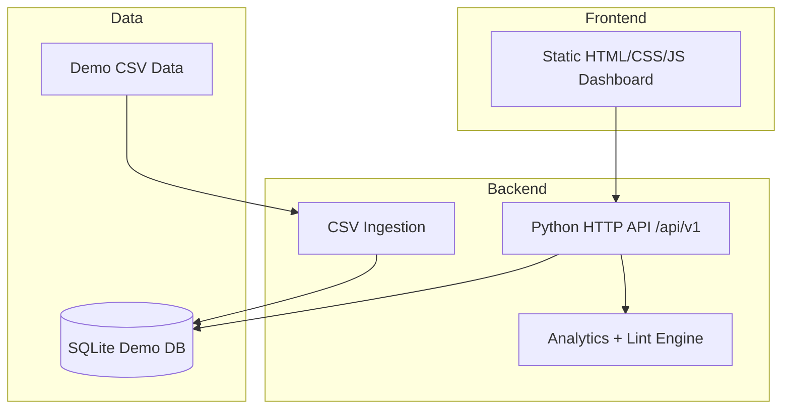
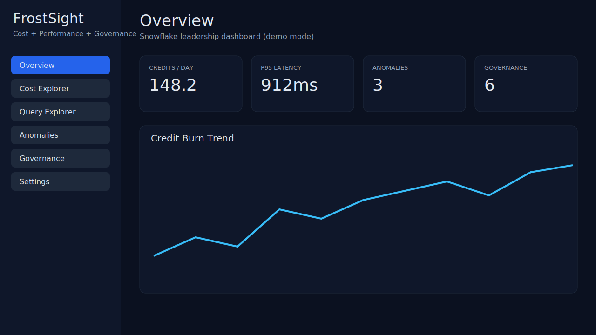

# FrostSight: Snowflake Cost + Performance + Governance Control Plane

FrostSight is a CTO-grade, offline-first control plane for Snowflake engineering leadership. It runs fully in demo mode without credentials, ships with deterministic ACCOUNT_USAGE-like data, and exposes cost, performance, and governance insights through a lightweight Python API and a static dashboard.

## Architecture


## 3-minute quickstart (demo mode)
```bash
python data/generate_demo_data.py
PYTHONPATH=apps/api python -m app.main
```
Open `apps/web/index.html` in your browser and confirm data loads from the local API.

## Demo mode (default)
- Runs on deterministic CSVs in `data/demo/`.
- Ingests into SQLite (`data/demo/frostsight_demo.db`).
- No credentials required.

## Snowflake mode (optional)
Set Snowflake env vars to see configuration status in Settings.

```bash
export SNOWFLAKE_ACCOUNT=...
export SNOWFLAKE_USER=...
```

## Repo layout
```
apps/api        # Python backend (stdlib only)
apps/web        # Static dashboard
packages/shared # legacy shared types (unused in demo)
```

## Screenshots


## Development
```bash
make verify
```

## License
MIT. See [LICENSE](LICENSE).
